# 界面设计文档

## 1用户相关

### 1.1注册页

####界面

#### 业务逻辑流程图

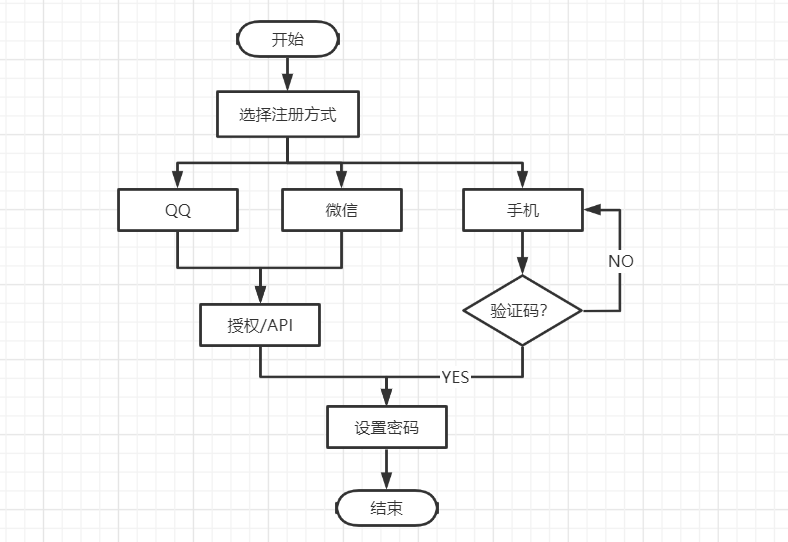

###1.2登录页

#### 界面

#### 业务逻辑流程图

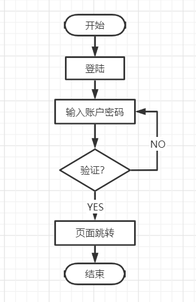

### 1.3个人设置页

#### 界面

#### 业务逻辑流程图

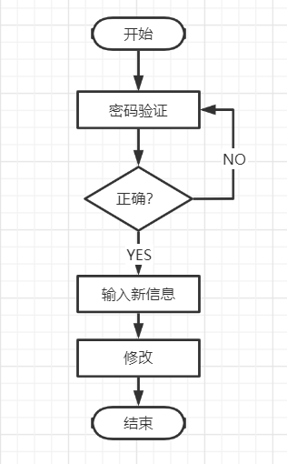

## 2首页

#### 界面

#### 业务逻辑流程图

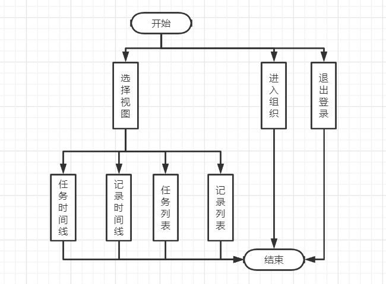

## 3视图类

###3.1记录时间线视图

#### 界面

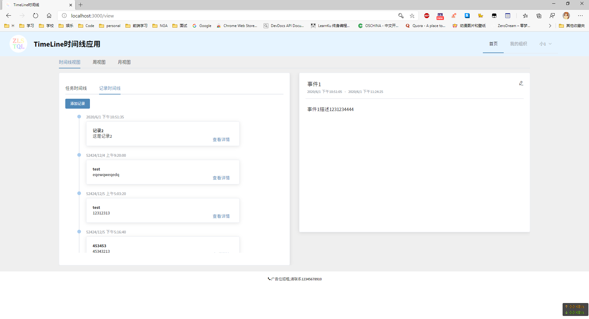

### 3.2任务时间线视图

#### 界面

#### 业务逻辑流程图

### 3.3周视图

#### 界面

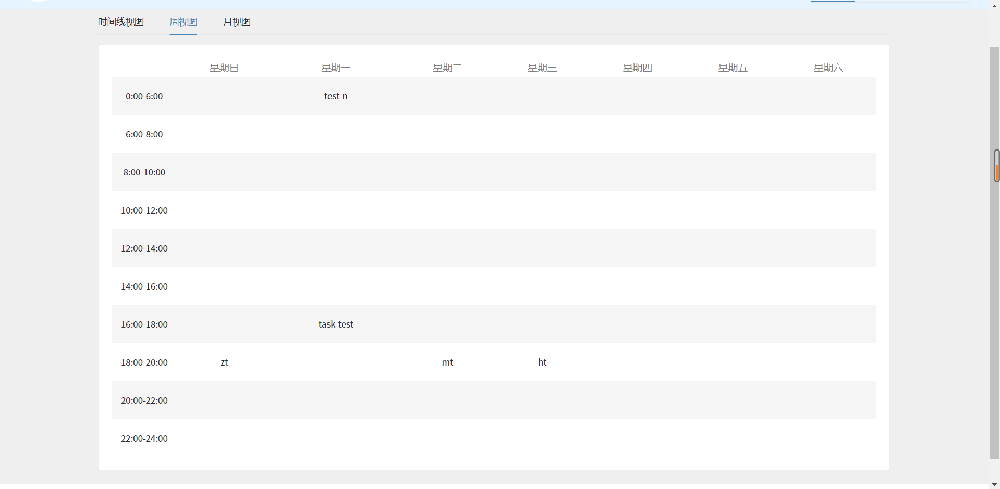

### 3.4月视图

#### 界面

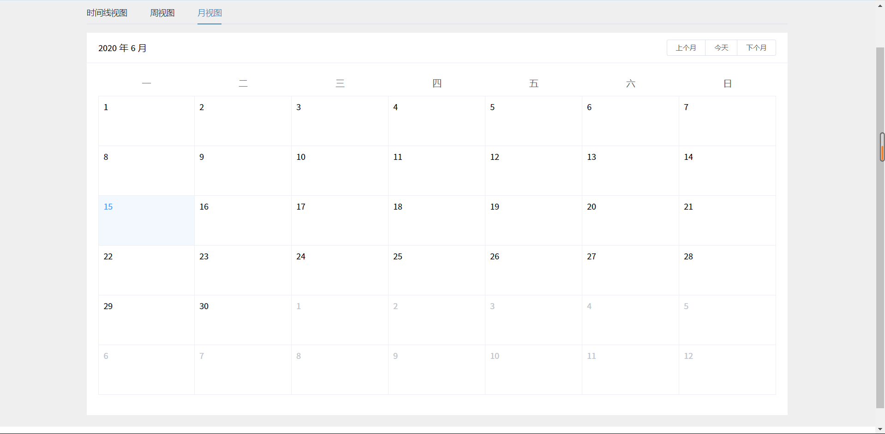

#### 业务逻辑流程图

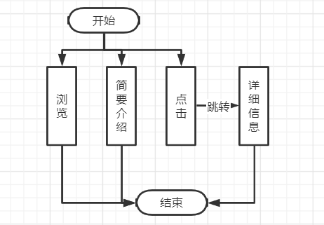

## 4记录相关

### 4.1记录列表页

#### 界面

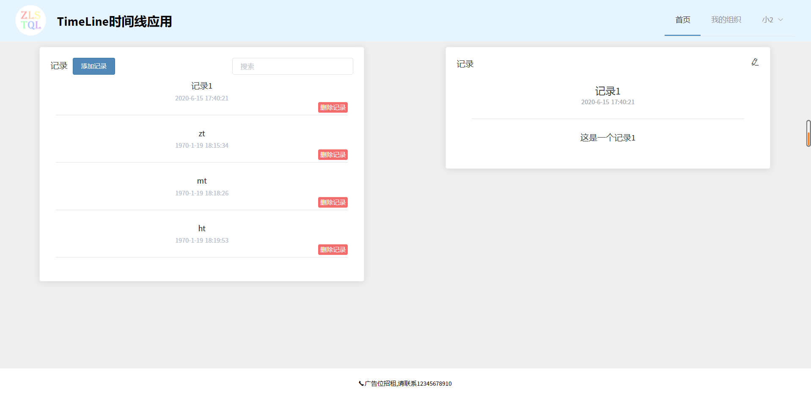

### 4.2添加记录页

#### 界面

### 4.3修改记录页

#### 界面

## 5任务相关

### 5.1任务列表页

#### 界面

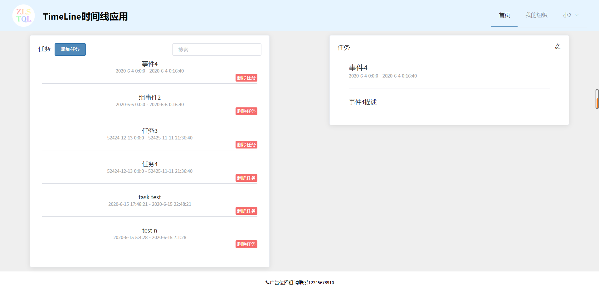

### 5.2添加任务页

#### 界面

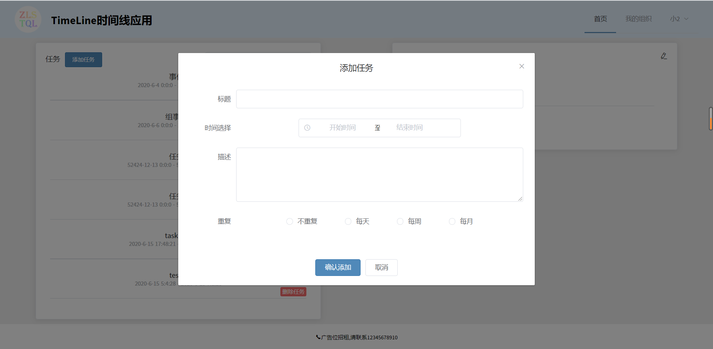

### 5.3修改任务页

#### 界面

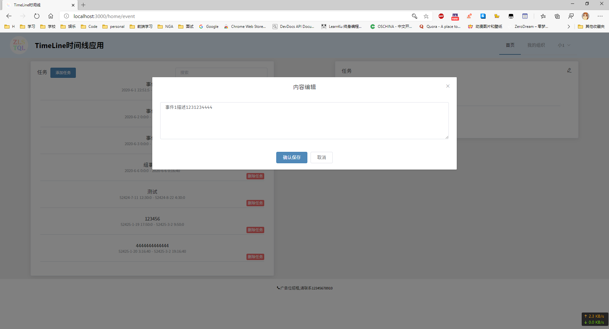

#### 业务逻辑流程图

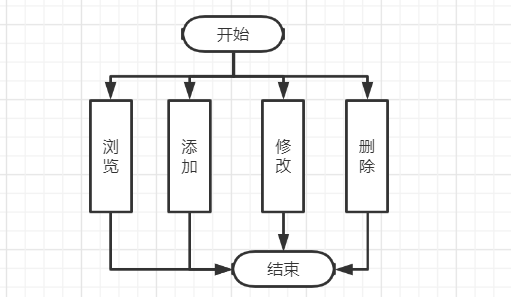