# 项目建议书

[TOC]

# 1项目简介

## 1.1项目背景

​	如今，是一个信息爆炸时代，在大量碎片化信息的冲击中，我们逐渐被信息洪流裹挟，面对碎片化的目标，突如其来的任务不知所措，而匆匆忙忙中，生活的碎片也被时间的洪流冲散，被失落在过去的某一时刻。因此，一款时间线应用对我们来说十分重要，规划时间，勾连记忆的碎片，记录生活，提高效率。

## 1.2问题与机会

### 问题

- 如何正确的设计界面避免可能部分文字和信息太过于密集
- 满足一些用户使用时的习惯，如需要使用 `markdown` 来书写文字，夜间模式等
- 开发与运维成本还是一个未知数
- 市场推广方面，当前市场方向倾向于大公司流量推荐和应用商店独立推荐
- 如何布局全平台
- 应用社交模式的方向
- 分享的模式，如何通过分享吸引更多的用户
- 如何让软件更加智能，使其符合用户习惯

### 机会

- 市面上关于这种时间线类型应用比较少，可以抢占市场先机
- 添加用户群组，使得组织者可以查看其他人员的时间安排
- 经调查发现，存在着多数人群对记事软件的需求
- 部分企业寻求这样的管理员工时间线软件
- 现在大部分的记事 APP 都是个人开发，少部分是大公司开发，如果能够系统地去开发，可以抢占市场

## 1.3项目介绍

> 时间线应用是什么？

一个以时间线和核心的应用，在这里你可以管理你的多条时间线。

只需要几步，你就能把你的时间线变成笔记、待办、日程、日记等，并以时间轴为载体进行记录。

> 时间线应用有哪里不同？

帮助大家经营人生琐碎，串成一条时间的轴线，以下是部分功能：

- 多条时间线相互独立，记录一切
- 智能日程安排和提醒
- 代办事项与自定义模版
- 与大家分享时间线，与组织共享时间安排
- 全平台通用，随时随地同步
- 社交，在相同的时间遇见不同的人
- 等等……

# 2系统分析

## 2.1可行性分析

### 运行可行性

时间线应用致力于以时间轴为线，将生活中的一件件任务、日程的“点”用线串联起来，帮助用户规划时间，记录生活，对于用户来说，这是一款值得使用的应用，而所建立的系统将支持安卓、iOS等目前主流平台多平台运行，简洁高效、以更强的兼容性解决目前存在的时间规划混乱、对未来的计划不清晰、对过去的经历没有总结的问题。此外，本应用操作简单，没有对用户的素质背景要求，非熟练操作人员也可以经过短暂尝试快速上手。因此，该方案具有运行可行性。

### 文化可行性

当今时代，时间的使用效率是影响成就的关键，有效的利用时间、规划时间能够帮助用户更好的完成任务，实践计划， 而时间线的应用与现有的打卡完成代办应用不同，它的时间线包括未来，也囊括过去，使用户可以不断地比对自己的计划和完成情况，不断缩小差距，不断复盘人生。

从记录过去的时间线这个功能来看，本应用可以帮助用户记录过去发生的事件，清晰明了的向用户展示用户过去的时间分配，帮助用户反思自身的时间利用效率，反思自身之前花费的时间投资是否值得，而在用户久久未有成就感时，回顾过去时间线上自己的努力也有助于用户重拾信心，自我激励。与此同时，本应用支持的日记、心情记录功能可以帮助用户记录生活中的小细节，标注平凡生活中的不平凡，待得将来回顾时，一点一滴的细节都会是记忆中的闪光点，是人生经历中不可抹去的一部分。而找回被遗忘的记忆碎片本身也将是惊喜中的一员。

从规划未来的时间线这个功能来看，本应用可以帮助用户规划每日日程，记录代办任务，进行时间提醒，让用户可以清晰的知道自己的任务规划，不错过、遗忘应当完成的任务，预提醒功能可以帮助用户留足富裕时间完成任务。且一个时间线型的未来规划可以帮助用户更好的利用碎片时间，清晰的知道自己的空闲时间有哪些，更加明了的运用自己的时间。

从以上几个角度来看，最终用户会满意此版设计方案，该方案具有文化可行性。

### 技术可行性

> 硬件条件

本应用预计使用云服务器提供商的服务器产品，例如阿里云。相较于传统的模式，云服务器简单易用，性价比更高，提供商同时提供应用一键部署、一站式域名解析、网站发布、安全、运维、应用管理等服务，使用 SSD 存储，而价格相对整体配置打包价格较低，极大地优化了应用体验，并提供丰富的应用集成。

> 软件条件

本应用采用混合开发，以支持各个主流平台的使用，没有对系统的必须性要求。

> 技术人员条件

本应用的开发拥有足够强力的开发团队支持，可以高效完成各个相应平台上的应用开发，能够快速正确的应用所需的技术，并支持后期的系统维护。

> 物理资源

本应用目前暂时没有对物理资源的需求。

综上所述，本应用在技术上可行，开发团队也拥有并熟练使用相关技术，该方案具有技术可行性。

### 进度可行性

本应用的截止期限是2020年6月7日，涵盖了需求分析、架构设计、开发和测试等过程，该期限属于期望期限。预计采用7个工作日进行项目规划，14个工作日进行系统分析与设计，15个工作日进行应用的开发与测试。详细进度安排参见后文MOV时间计划表。在时间安排上，本项目具有进度可行性。

### 经济可行性

> 资金可得性

软件初始由本团队进行初步开发，服务器采用弹性云服务器，无差旅、办公等费用，初始成本较低，可以支持开发。

> 经济合理性

本项目运行后，主要成本来源于服务器租用、人员费用、运维人员费用、本产品广告投放费用等，收入则主要来源于其他产品广告推广、付费功能解锁、企业定制等。具体效益参照后文成本效益分析。从投资回报率来看，本项目具有经济可行性。

### 法律可行性

本应用是自主开发设计，不会构成侵权，与雇佣员工签订相关合同，双方均受到法律制约。应用中所有付费项目均会清晰告知用户，并给予醒目提醒，不强制用户消费。并会认真筛选商业广告，筛去违法内容。因此，本项目具有法律可行性。

## 2.2成本效益分析

### 成本分析

> 服务器租用

估价：7500元/月

中期需用中等性能服务器即可满足此时用户数量用户的需求，用户规模增长后考虑升级。

> 软件开发

混合开发工程师：5000元/月 2名

后台工程师：6000 元/月 1名

总估价：16000元/月

使用混合开发，一份代码覆盖移动端+Web，开发后台，逐步完善功能，吸收用户反馈，照顾用户体验。

> 软件运维

估价：4000元/月 1名

维护后台，保证稳定运行。观察资源使用状态，与开发进行交流反馈。

> 广告投放

估价：3000元/月

投放广告，加速扩大用户规模。

### 收益

> 广告

估计：10000元/月

收到其他产品的广告，展示在启动页及其他部分。

> 会员/付费功能解锁

估计：1000人 * 15元 /月

总计：15000 元/月

用户付费解锁核心功能的某些限制，关闭广告等。

> 企业定制

估计: 10000元/月

企业以月为单位购买产品，根据企业规模定价，企业内用户免费解锁全部功能，企业获得定制功能。

### 投资回报率

这里使用投资回报率 ROI 公司进行计算
$$
ROI=\frac{总利润}{投资总额} \times 100\%=\frac{总支出-总收益}{总支出}\times 100\%
$$

$$
总支出：(7500 + 16000 + 4000 + 3000) = 30500 \ 元/月
$$

$$
总收益：(10000 + 15000 + 10000) = 35000 \ 元/月
$$

$$
ROI = \frac{35000 - 30500}{30500} \times 100\%= 14.7 \%
$$

------

# 3项目管理建议

## 3.1项目阶段

> 项目前期

- 项目规划——确定项目主题，制定项目计划
- 需求分析——分析用户需求，作为功能设定的基础
- 软件设计
  - UI——用户交互界面设计
  - 数据库——后台组成部分
- 运营设计——软件发行后的经营方式

> 项目实施

各功能模块初步设计如图，开发阶段有调整，以项目设计阶段为准。

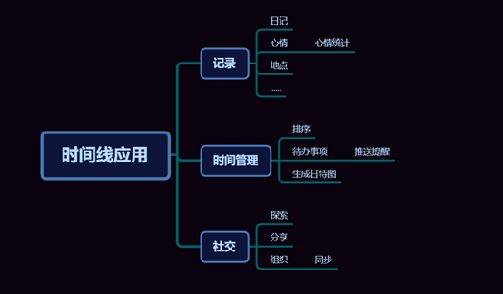

> 项目后期

- 系统集成——综合各功能，前端与后台
- 系统测试——集成后根据项目需求进行软件测试

## 3.2估算活动

因为暂无往期项目参照，故采用专家判断法。

| 活动名称       | 估算时间（单位：工作日）  |
| -------------- | :-----------------------: |
| 项目规划       |             7             |
| 需求分析       |             9             |
| 软件设计       |             5             |
| 项目实施       |            12             |
| — 记录功能     |             4             |
| - 日记         |             1             |
| - 心情         |             2             |
| - 地点         |             1             |
| - 其他         | 0（适用于软件发行后更新） |
| — 时间管理功能 |             3             |
| - 待办事项     |             1             |
| - 排序         |             1             |
| - 甘特图生成   |             1             |
| — 社交功能     |             5             |
| - 探索         |             1             |
| - 分享         |             1             |
| - 组织         |             3             |
| 系统集成       |             2             |
| 系统测试       |             1             |

## 3.3进度规划

> 甘特图


> 关键路径

学生开发，项目实施阶段具体功能实现时会出现并行开发情况，其余情况按计划依次推进，故关键路径为下。36工作日（有效工作时间），实际时间为16周。

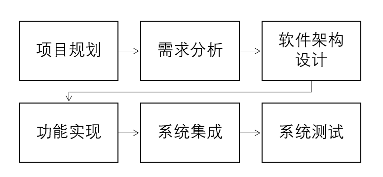

> 里程碑

|     事件     |   时间    |
| :----------: | :-------: |
|   项目规划   | 2020/3/16 |
|   需求分析   | 2020/3/16 |
| 软件架构设计 | 2020/3/25 |
|   记录功能   | 2020/4/8  |
| 时间管理功能 | 2020/4/22 |
|   社交功能   | 2020/5/13 |
| 系统合并集成 | 2020/6/1  |
|   系统测试   | 2020/6/7  |

------

# 4需求分析

## 4.1功能性需求分析

## 4.1.1记录功能

​	时间线上的元素分为**记录**和**任务**两种，本部分将介绍**记录**，记录可以理解为类似于日记但形式更加丰富的记录形式。

### 用例图

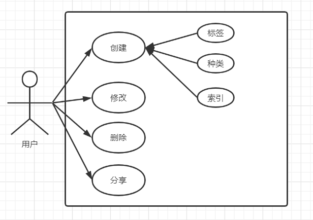

### 用例描述

**创建**

​	用户创建自己的记录。内容可以为以下几方面。

| 名称     | 描述                                           | 必填 |
| -------- | ---------------------------------------------- | ---- |
| 时间点   | 事件发生的时间点                               | yes  |
| 标题     | 事件的标题                                     | no   |
| 文字描述 | 事件内容                                       | no   |
| 图片     | 配图，0-9张，应提供图片编辑，白板涂鸦功能      | no   |
| 音频     | 0-1条，可通过添加记录界面的录音部分上传音频    | no   |
| 标签     | 心情，地点，以及其它自定义标签，可用于事件索引 | no   |
| 是否共享 | 共享记录以获取其他人共享的一定范围内记录       | yes  |

**修改/删除**

​	创建记录后，用户可以对内容进行修改，同时也可以删除该条记录。

**分享**

​	创建记录后，用户可以分享创建的记录，分享范围可以自定义。

## 4.1.2任务功能

​	本部分内容是对TimeLine这个应用的"任务"需求方面的概述，其中包括了内容、消息推送和管理这三个功能模块的需求分析。

### 用例图


### 用例描述

**创建**

​	用户可以创建任务，并在创建后浏览。任务可包括的内容有目的、名称、Tag、时间段、分类等多方面。

**消息推送**

​	用户创建任务后，可以打开消息推送以便消息通知，及时完成任务。

**管理**

​	任务的修改删除等操作。可以生成索引，按索引查看。

## 4.1.3社区功能

用户可以分享自己的任务或者记录等信息，同时也可以查看同样使用此功能的其他用户分享的信息。

### 用例图

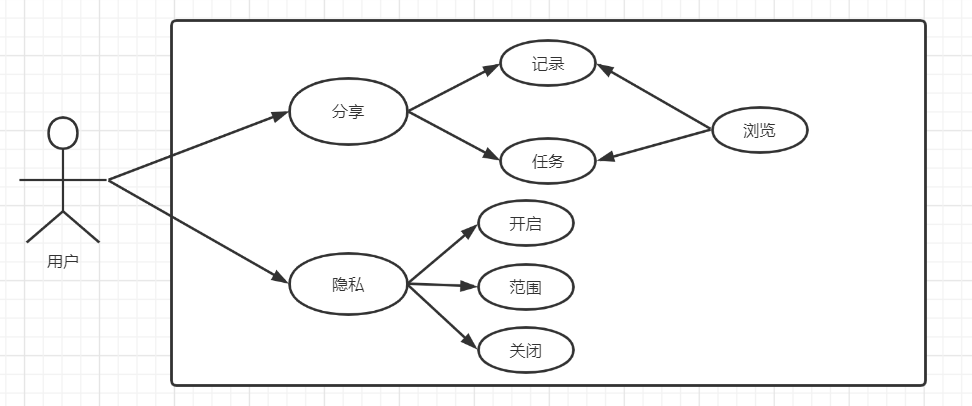

### 用例描述

**分享：**

​	记录：用户可以分享自己的各类记录到社区。

​	任务：用户可以分享自己制定的任务到社区。

​	浏览：用户可以浏览查看其他用户分享到社区的内容。

**隐私：**

​	开启：其他使用社区功能的用户均可以浏览该用户分享的各类内容。

​	范围：用户可以设置自己想要分享的记录或任务的范围，如按天、按地点等方式。

​	关闭：隐私最高等级，其他用户无法查看该用户分享的内容，意味着社区功能关闭。


## 4.1.4视觉功能

用户数据的可视化功能，包含用户设置界面，用户可以进行多种个性化设置；数据可视化功能，生成时间表、甘特图等可视化组件，便于用户查看。

### 用例图


### 用例描述

**设置：**

​	账号：用户可以进行账号相关的设置，同时可以进行登陆退出等操作。

​	推送：用户可以打开或者关闭消息推送通知。

​	安全：用户进行安全性相关的设置，如设置软件权限等。

​	通用：通用设置。

**可视化：**

​	<u>时间表：</u>根据用户输入的任务生成包含时间+任务简要描述的时间表，单位为每日/每周。

​	用户可设置周期性任务，如每周三4：00pm-6：00pm打篮球，此类任务在生成时间表时会自动添加。

​	生成时间表后，用户可以按照不同的时间尺度查看。如，用户的任务或记录可按日/月/年为单位生成缩略图。

| 时间单位 | 描述                                            |
| -------- | ----------------------------------------------- |
| 按日     | 形式为时间线，显示具体任务/记录描述和Tag。      |
| 按月     | 形式为每日缩略图，缩略图中只有Tag，可选中放大。 |
| 按年     | 形式为按月分割+日期数字，可选中查看。           |

​	<u>甘特图：</u>根据用户制定的任务安排生成甘特图，利于用户根据甘特图查看自己的进度，并安排管理自己的时间。

​	<u>数据统计：</u>对用户的任务/记录做数据统计。

​	如该用户一年里一共完成了多少项任务；

​	用户一年中心情统计是怎样的，一年中有多少天是开心的或悲伤的等；

​	用户在某一段时间里去过哪些地方等。

## 4.1.5账户功能

用户可以离线在本地使用本应用，也可以注册并登录之后使用。账户功能能为用户提供同步、分享等更多的功能与服务。

### 用例图


### 用例描述

**登录：**用户使用注册的账户登录到软件。

**注册：**用户使用自己的个人信息进行帐号注册。

**为功能支付：**对于一些付费的功能，用户可以通过付费对这些功能进行解锁。

**个人信息和主页：**

​	修改：对用户个人主页上的信息进行修改。

​	浏览：对用户个人主页上的信息进行浏览和查看。

**多终端同步**：将本地的时间线将自动与云端同步，保证本地与云端数据一致。

## 4.1.6组织功能

### 用例图

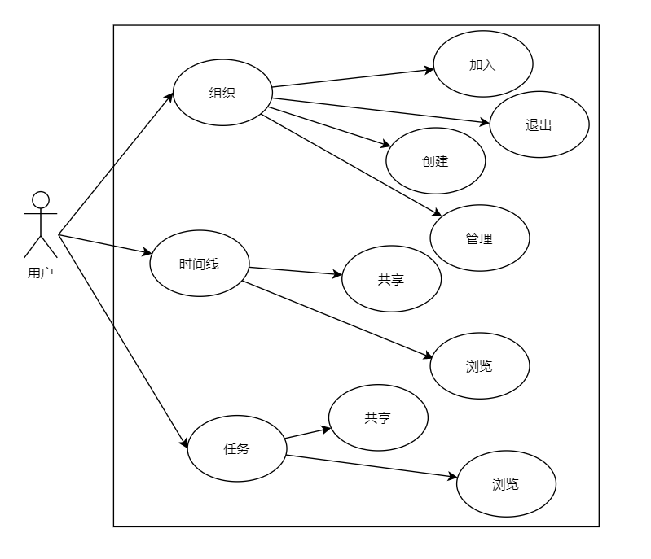

###用例描述

**组织：**

​	加入：用户可以自由申请并加入一个组织。

​	退出：用户可以自由退出一个组织。

​	创建：用户可以申请创建一个组织。

​	管理：对于自己创建的组织，用户有权限进行管理。

**时间线：**

​	共享：在组织中，用户可以共享自己的时间线。

​	浏览：在组织中，用户可以浏览其他成员共享的时间线。

**任务：**

​	共享：在组织中，用户可以共享自己的任务，并与相关人员一起完成任务。

​	浏览：在组织中，用户可以浏览其他成员共享的任务。

##4.1.7其他功能

###用例图

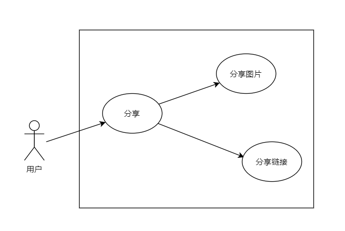

###用例描述

**分享：**

​	分享图片：用户可以将自己的时间线以图片的形式进行分享，如分享到朋友圈。

​	分享链接：用户可以将自己的时间线以链接的形式进行分享，如以电子邮件分享。

## 4.2非功能性需求

### 4.2.1性能需求

- 支持多用户同时操作
- 处理的文件数和记录数：1万
- 数据库大小限制：不超过硬盘容量
- 单条记录大小限制：不超过数据库大小限制
- 存取单条记录时间：不超过1秒
- 按照索引获取记录时间：不超过1秒

### 4.2.2属性

### 可用性

- 用户操作页面加载失败时，提醒用户重试或重启进行加载
- 当客户端由于未知原因死机时，可以通过重启软件来排除故障
- 服务器宕机也可以用重启方式恢复。

### 可靠性

- 在现有软件和硬件条件和没有出现错误操作情况下，所有模块可以稳定无故障运行
- 可以屏蔽用户错误操作

### 易用性

- 用户在简单的操作引导下可以快速上手使用软件
- 对用户的操作进行即时的反馈
- 执行不可逆操作时对用户进行提示
- 支持夜间模式、markdown语法等用户使用习惯

### 安全性

- 用户在记录事件和进行社区分享时，设置为“隐私”的内容对其他用户不可见
- 用户多次登录密码错误时对用户进行安全验证，防止偶然或恶意访问
- 对数据库进行备份，预防数据丢失
- 完善数据库日志管理

### 可维护性

​    模块之间数据连接简洁明了，维护方便，功能增加修改简单方便，软件结构符合软件设计原则。

### 可移植性

​    软件需要支持在多平台运行，包括网页端、安卓端、ios端，采用通用性设计语言，分离不可移植代码，使环境变化后软件可以无需许多修改就可以运行。

## 4.3外部接口需求

### 4.3.1用户接口

- 界面需求：简洁美观，配色柔和
- 屏幕格式：无明确要求
- 输入输出时间：超出3分钟没有响应提醒用户

### 4.3.2软件接口

- 允许外接QQ或微信进行软件外部分享
- 允许访问本地相册
- 允许调用相机
- 允许调用麦克风
- 允许访问手机桌面

### 4.3.3通信接口

​    网络协议：TCP/IP

# 5系统概要设计

## 5.1总体架构设计

// TODO

## 5.2功能模块设计

​	根据需求分析，将系统前台分为六个大模块：记录功能、任务功能、社区功能、组织功能、账户相关、视觉功能。功能模块图下图所示。

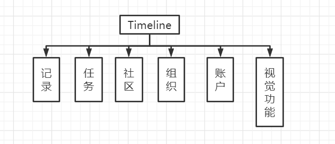

### 记录模块

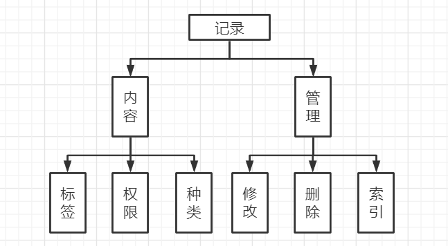

**内容**

​	种类：可以上传文字描述，图片和音频等多种形式记录，VIP用户有更多使用权限。

​	权限：用户可以设置记录查看的权限。

​	标签：每条记录都会有标签，包含心情、地点等种类，用于事件索引。

​	其他：记录标题、记录时间点等通用内容。

**管理**

​	修改/删除：用户可以修改删除已创建的记录。

​	索引：可根据时间，关键字，标签等进行记录索引。

### 任务模块

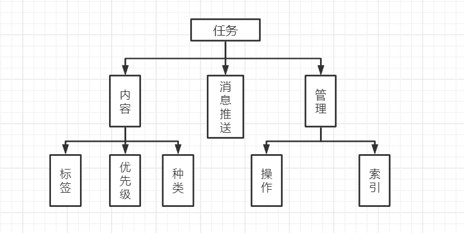

**内容**

​	标签：对内容优先级或者地点等特征值描述，可以用来建立索引。

​	优先级：任务的优先级。

​	种类：不同类型的任务，有多种分类标准，如重复与否等。

​	其他：任务标题，任务时间地点等相关内容。

**消息推送**

​	用户可以开启消息推送以便及时获得任务进度的通知。

**管理**

​	操作：对任务创建/修改/删除等操作。

​	索引：用户可以根据索引来寻找到特定范围的内容，例如限制了时间、地点等范围。

### 社区模块

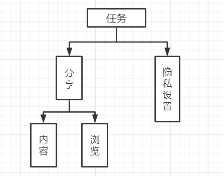

**分享：**

​	内容：用户可以分享自己的任务和记录等多种内容到社区。

​	浏览：用户可以浏览查看其他用户分享到社区的内容。

**隐私：**

​	用户可以设置自己的分享内容查看权限，分为开启、限制和关闭三个等级。

### 组织模块

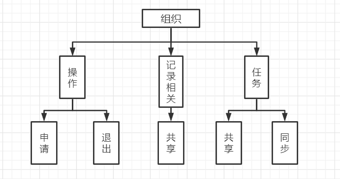

**操作**

​	申请：用户可以申请加入组织。

​	退出：用户可以退出已经加入的组织。

**记录相关**

​	用户可以共享自己的记录，组内其他用户可以查看。

**任务相关**

​	共享：用户可以向组内成员共享自己的任务。

​	同步：小组发布的任务可以同步到每个小组成员的任务列表（时间线）中。

### 账户相关

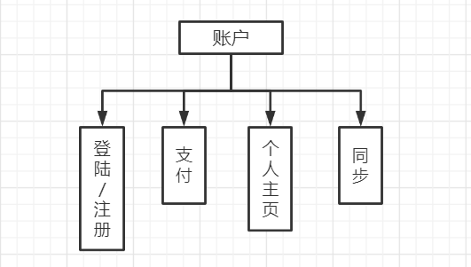

**登录\注册：**

​	用户使用注册的账户登录到软件;用户使用自己的个人信息进行帐号注册。

**支付：**

​	对于一些付费的功能，用户可以通过付费对这些功能进行解锁。

**个人主页：**

​	浏览：对用户个人主页上的信息进行浏览和查看。

​	修改：对用户个人主页上的信息进行修改。

**多终端同步**：

​	将本地的时间线将自动与云端同步，保证本地与云端数据一致。

### 视觉相关


**设置：**

​	账号：用户可以进行账号相关的设置，同时可以进行登陆退出等操作。

​	安全：用户进行安全性相关的设置，如设置软件权限等。

​	通用：其他通用设置。

**可视化：**

​	时间表：根据用户输入的任务生成包含时间+任务简要描述的时间表，单位为每日/每周。生成时间表后，用户可以按照不同的时间尺度查看。如，用户的任务或记录可按日/月/年为单位生成缩略图。

​	甘特图：根据用户制定的任务安排生成甘特图，利于用户根据甘特图查看自己的进度，并安排管理自己的时间。

​	数据统计：对用户的任务/记录做数据统计。如该用户一年中心情统计是怎样的，一年中有多少天是开心的或悲伤的等。

## 5.3数据库设计

## 5.3.1概念结构

​	构成 E-R 图的 3 个基本要素是实体、属性和联系。实体之间有三种关系：一 对一、一对多、多对多。实体与实体之间的联系也可以有属性。 

​	通过对系统的分析，抽象出的实体主要有：用户、任务、记录和组等。各实体之间的E-R关系图如图所示：（可能待调整）


## 5.3.2逻辑结构

​	根据系统需求和功能模块设计以及数据库概念模型 E-R 图的设计，共设计了 9 张数据基本表。

​	后续还会对系统进行优化，开发更多新模块，因此在表的设计中需要保证未来可拓展性。 各模块的关系模型如下：

​	(1) 注册用户表（用户ID，QQ号，微信号，手机号，密码）

​	(2) 在线用户表（用户ID，对应token）

​	(3) 用户信息表（用户ID，昵称，注册时间，是否VIP）

​	(4) 任务表（任务ID，用户ID，组ID，任务标题，任务开始时间，任务结束时间，任务描述，任务重复类别）

​	(5) 记录体表（记录ID，用户ID，记录标题，记录时间，记录描述）

​	(6) 记录图片表（记录ID，图片ID，图片排序位置）

​	(7) 组申请记录表（组ID，用户ID）

​	(8) 组成员表（组ID，用户ID）

​	(9) 组信息表（组ID，组成员ID，组名）

​	以上数据表中，各表主键均已在途中用金色钥匙🔑符号标出，由于外键的约束会导致复杂的 删除问题，降低效率，所以在数据表的设计中没有设置外键。 

## 5.3.3物理结构

​	各类表具体信息见下。

### 注册用户表

| 列名     | 类型        | 描述                 |
| -------- | ----------- | -------------------- |
| uid      | INT         | 用户ID               |
| qqid     | VARCHAR(32) | 用户注册使用的QQ号   |
| wechatid | VARCHAR(32) | 用户注册使用的微信号 |
| phone    | VARCHAR(20) | 用户注册使用的手机号 |
| pwd      | VARCHAR(32) | 用户的注册密码       |

### 在线用户表

| 列名  | 类型        | 描述                |
| ----- | ----------- | ------------------- |
| uid   | INT         | 用户ID              |
| token | VARCHAR(32) | 和uid一起做身份验证 |

### 用户信息表

| 列名     | 类型   | 描述         |
| -------- | ------ | ------------ |
| uid      | INT    | 用户ID       |
| nickname | INT    | 用户昵称     |
| regtime  | BIGINT | 用户注册时间 |
| isVIP    | INT    | 是否为VIP    |

### 任务表

| 列名   | 类型   | 描述                       |
| ------ | ------ | -------------------------- |
| tid    | INT    | 任务ID                     |
| uid    | INT    | 用户ID                     |
| gid    | INT    | 组ID（-1代表非组任务）     |
| title  | TEXT   | 任务标题                   |
| begin  | BIGINT | 任务开始时间               |
| end    | BIGINT | 任务结束时间               |
| detail | TEXT   | 任务描述                   |
| type   | INT    | 任务重复类型（每日每周等） |

### 记录体表

| 列名   | 类型   | 描述           |
| ------ | ------ | -------------- |
| rid    | INT    | 记录ID         |
| uid    | INT    | 用户ID         |
| title  | TEXT   | 记录标题       |
| time   | BIGINT | 记录创建的时间 |
| detail | TEXT   | 记录描述       |

### 记录图片表

| 列名  | 类型        | 描述         |
| ----- | ----------- | ------------ |
| rid   | INT         | 记录ID       |
| picid | VARCHAR(64) | 图片ID       |
| pos   | INT         | 图片排序位置 |

### 组申请记录表

| 列名 | 类型 | 描述   |
| ---- | ---- | ------ |
| gid  | INT  | 组ID   |
| uid  | INT  | 用户ID |

### 组成员表

| 列名 | 类型 | 描述   |
| ---- | ---- | ------ |
| gid  | INT  | 组ID   |
| uid  | INT  | 用户ID |

### 组信息表

| 列名  | 类型 | 描述         |
| ----- | ---- | ------------ |
| gid   | INT  | 组ID         |
| muid  | INT  | 组成员用户ID |
| gname | TEXT | 组名         |


# 6系统详细设计

## 6.1方案总览

## 6.1.1前台要求

| 地址             | 名称     | 描述                          |
| ---------------- | -------- | ----------------------------- |
| /login           | 登录页   | 登录/注册/找回密码            |
| /home            | 框架页   | 导航/用户基本信息/边栏        |
| /home/info       | 个人信息 | 个人信息详细页                |
| /home/time       | 时间线   | 记录任务可视化/添加/删除/索引 |
| /home/list       | 列表     | 记录任务/添加/删除/索引       |
| /home/group      | 组织表   | 浏览管理组织                  |
| /home/analize    | 数据分析 | 数据分析/社交平台分享         |
| /recinfo [pop]   | 记录信息 | 记录详细信息查看              |
| /taskinfo [pop]  | 任务信息 | 任务详细信息查看              |
| /groupinfo [pop] | 组织信息 | 组织详细信息查看              |

```
--注:[pop]为覆盖层页面
```

------

### 登录页

```
登录：社交登录，手机密码登录，手机验证码登录
注册：手机密码注册，应接收验证码（注，社交平台直接登录即可）
找回密码：手机+验证码
```

### 框架页

```
为主功能页面提供基本框架
通俗来讲是个功能选择器，子功能套在里面
有五个子功能的入口，有>80%的区域显示相应功能

顶栏显示用户名，点击后有下拉聊表框，应提供退出功能
```

### 个人信息页

```
展示详细个人信息，可修改
```

### 时间线

```
展示用户时间线，事件和记录以块的形式显示在线上，可点击直接进入详情
可切换尺度（日，周，月，年）
可添加记录
可添加事件
有索引功能（文字，标签，时间等）
```

### 列表

```
将事件和记录以列表的形式呈现，是2.4的文字版，功能一致。
```

### 组织表

```
与用户相关的组织列表，包含我管理的和我加入的两部分
可创建组织（仅询问组织名即可）
可加入组织
点击具体组织后进入组织详情页
```

### 数据分析

```
呈现数据分析结果
提供社交分享入口
```

### 记录信息[pop]

```
查看某记录的详细信息 或 添加新纪录
记录的共享开关在此，开启后查看位置在此
编辑记录
删除记录
```

### 任务信息[pop]

```
查看某任务的详细信息 或 添加新任务
个人任务与组织任务
编辑任务（如果可以）
删除任务（如果可以）
```

### 组织信息[pop]

```
成员列表
组织信息查看与修改
组织任务列表
发布任务（仅创建者）
点击任务列表中的人物pop任务详细信息，在里面可修改删除
申请加入者列表（仅创建者）
```

## 6.1.2后台要求

### 用户相关

| 地址          | 名称         |
| ------------- | ------------ |
| /user/login   | 登录         |
| /user/logout  | 登出         |
| /user/reg     | 注册         |
| /user/phone   | 发送验证码   |
| /user/info    | 用户信息     |
| /user/infoupd | 修改用户信息 |

### 任务相关

| 地址       | 名称         |
| ---------- | ------------ |
| /task/list | 任务列表     |
| /task/view | 查看单个任务 |
| /task/upd  | 修改任务     |
| /task/add  | 添加任务     |
| /task/del  | 删除任务     |

### 记录相关

| 地址           | 名称         |
| -------------- | ------------ |
| /rcd/list      | 记录列表     |
| /rcd/view      | 查看单个记录 |
| /rcd/upd       | 修改记录     |
| /rcd/add       | 添加记录     |
| /rcd/del       | 删除记录     |
| /rcd/picupload | 上传图片     |

### 搜索相关

| 地址    | 名称     |
| ------- | -------- |
| /search | 联合搜索 |

### 组织相关

| 地址          | 名称       |
| ------------- | ---------- |
| /group/list   | 组列表     |
| /group/make   | 创建组     |
| /group/del    | 删除组     |
| /group/join   | 申请加入组 |
| /group/manage | 加人/T人   |
| /group/info   | 组信息     |
| /group/upd    | 修改组信息 |

## 6.2前端

// TODO：界面设计+描述（描述最好用流程图，有时间画）

## 6.3后端

### 6.3.1总览

​	后端采用该Spring Boot框架，MySQL作为数据库存储。包之间的依赖关系见下图。Controller层负责接收请求，Service层对接受的请求进行逻辑处理，并调用Dao层（mapper）进行数据相关的操作。

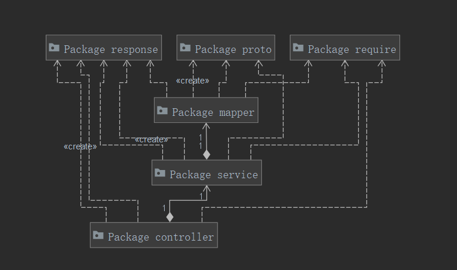

### 6.3.2Controller层

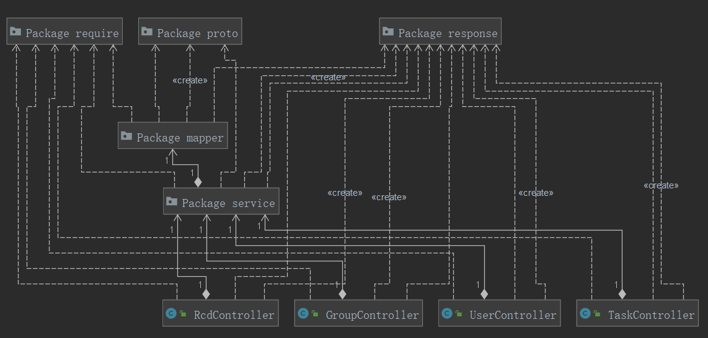

​	UserController：负责接收来自前端的用户相关的请求。

​	TaskController：负责接收来自前端的任务相关的请求。

​	RcdController：负责接收来自前端的记录相关的请求。

​	GroupController：负责接收来自前端的组织相关的请求。

​	*相关的请求连接请见6.1.2后台要求*

### 6.3.3Service层

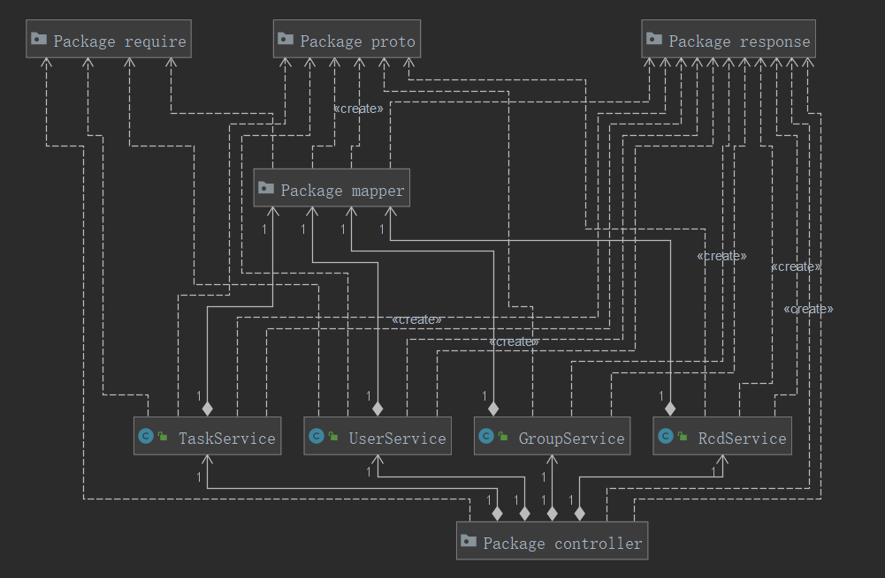

​	UserService：负责对来自前端的用户相关的请求进行逻辑处理。

​	TaskService：负责对来自前端的任务相关的请求进行逻辑处理。

​	RcdService：负责对来自前端的记录相关的请求进行逻辑处理。

​	GroupService：负责对来自前端的组织相关的请求进行逻辑处理。

### 6.3.4Dao层

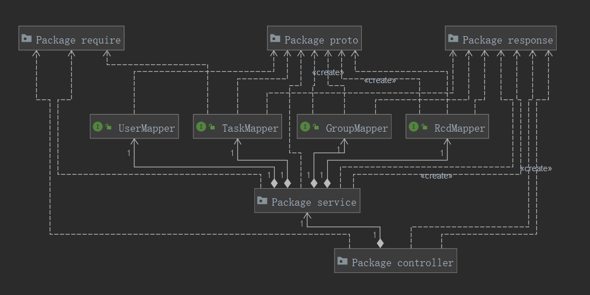

​	UserMapper：负责对来自前端的用户相关的请求进行数据库操作。

​	TaskMapper：负责对来自前端的任务相关的请求进行数据库操作。

​	RcdMapper：负责对来自前端的记录相关的请求进行数据库操作。

​	GroupMapper：负责对来自前端的组织相关的请求进行数据库操作。

## 6.4API

​	系统对来自前端的请求和产生的响应进行了抽离封装。

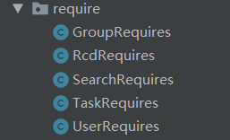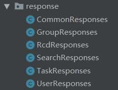

​	详细的接口设计请见接口文档“api.md".

# 7系统测试

​	在完成了系统功能开发之后，为了在产品上线前消除潜在的bug，我们需要根据系统测试理论对系统的相关功能和性能指标进行测试。系统测试是将已经集成好的软件系统，作为计算机系统的一个元素，与计算机硬件、某些支持软件、数据和人员等其他系统元素结合在一起，在实际运行环境下，对计算机系统进行一系列的集成测试和确认测试。

​	因为时间与成本原因，本项目只融合了黑盒与白盒测试技术，对系统进行了简单必要的测试。预期结果为通过的测试用例均已通过。以下列出了预期结果为不通过的功能测试样例，即可能会导致系统出错的样例。性能测试均已通过。

## 7.1用户相关

注册

| 测试用例   | 预期结果 | 结果 |
| ---------- | -------- | ---- |
| 无效手机号 | 注册失败 | 通过 |
| 错误验证码 | 注册失败 | 通过 |

登陆

| 测试用例           | 预期结果 | 结果 |
| ------------------ | -------- | ---- |
| 正确账号，错误密码 | 登陆失败 | 通过 |
| 错误账号，正确密码 | 登陆失败 | 通过 |
| 错误账号，错误密码 | 登陆失败 | 通过 |

登出

| 测试用例        | 预期结果 | 结果 |
| --------------- | -------- | ---- |
| 错误uid(不在线) | 登出失败 | 通过 |
| 错误token       | 登出失败 | 通过 |

## 7.2任务相关

操作（创建/修改/删除）

| 测试用例 | 预期结果 | 结果 |
| -------- | -------- | ---- |
| 过长标题 | 操作失败 | 通过 |
| 乱码内容 | 操作失败 | 通过 |
| 未来时间 | 操作失败 | 通过 |

消息推送

| 测试用例         | 预期结果 | 结果 |
| ---------------- | -------- | ---- |
| 开始时间阶梯测试 | 定时提醒 | 通过 |
| 结束时间接替测试 | 定时提醒 | 通过 |

## 7.3记录相关

内容

| 测试用例     | 预期结果     | 结果 |
| ------------ | ------------ | ---- |
| 过长标题     | 内容操作失败 | 通过 |
| 过大图片     | 内容操作失败 | 通过 |
| 多种格式图片 | 内容操作失败 | 通过 |
| 乱码内容     | 内容操作失败 | 通过 |

## 7.4组织相关

操作（创建/删除组，申请/T人等）

| 测试用例             | 预期结果 | 结果 |
| -------------------- | -------- | ---- |
| 创建大于人数限制的组 | 创建失败 | 通过 |
| T出无效用户          | T人失败  | 通过 |
| 申请加入不存在的组   | 申请失败 | 通过 |

组信息修改

| 测试用例     | 预期结果 | 结果 |
| ------------ | -------- | ---- |
| 过长组名     | 修改失败 | 通过 |
| 组成员ID修改 | 修改失败 | 通过 |

## 7.5其他

搜索

| 测试用例       | 预期结果 | 结果 |
| -------------- | -------- | ---- |
| 过长搜索关键字 | 无法搜索 | 通过 |
| 无效关键字     | 无法搜索 | 通过 |

共享

| 测试用例       | 预期结果 | 结果 |
| -------------- | -------- | ---- |
| 隐私模式共享   | 共享失败 | 通过 |
| 查看无权限信息 | 查看失败 | 通过 |

同步

| 测试用例           | 预期结果 | 结果 |
| ------------------ | -------- | ---- |
| 不支持机型         | 同步失败 | 通过 |
| 过低版本           | 同步失败 | 通过 |
| 断网同步           | 同步失败 | 通过 |
| 不属于组的用户同步 | 同步失败 | 通过 |

可视化

| 测试用例     | 预期结果   | 结果 |
| ------------ | ---------- | ---- |
| 空数据       | 无法可视化 | 通过 |
| 错误范围限定 | 无法可视化 | 通过 |

## 7.6性能测试


| 测试描述                 | 期望标准             | 测试结果 |
| ------------------------ | -------------------- | -------- |
| 用户同时操作             | 支持                 | 通过     |
| 处理的文件数和记录数     | 10000                | 未知     |
| 数据库大小限制           | 不超过硬盘容量       | 通过     |
| 单条记录大小限制         | 不超过数据库大小限制 | 通过     |
| 存取单条记录时间限制     | 1s                   | 通过     |
| 按照索引获取记录时间限制 | 1s                   | 通过     |