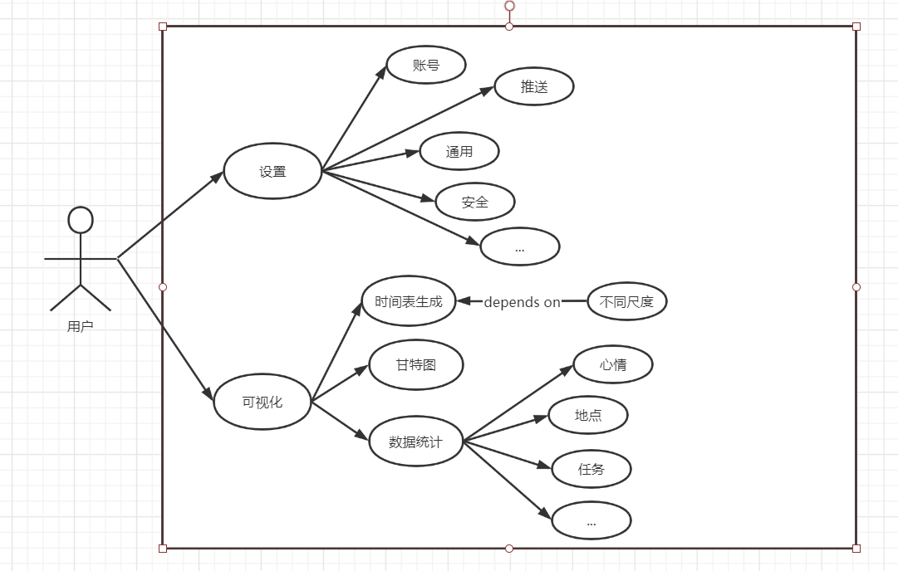

## 社区功能

用户可以分享自己的任务或者记录等信息，同时也可以查看同样使用此功能的其他用户分享的信息。

### 用例图

### 用例描述

**分享：**

​	记录：用户可以分享自己的各类记录到社区。

​	任务：用户可以分享自己制定的任务到社区。

​	浏览：用户可以浏览查看其他用户分享到社区的内容。

**隐私：**

​	开启：其他使用社区功能的用户均可以浏览该用户分享的各类内容。

​	范围：用户可以设置自己想要分享的记录或任务的范围，如按天、按地点等方式。

​	关闭：隐私最高等级，其他用户无法查看该用户分享的内容，意味着社区功能关闭。

## 视觉功能

用户数据的可视化功能，包含用户设置界面，用户可以进行多种个性化设置；数据可视化功能，生成时间表、甘特图等可视化组件，便于用户查看。

### 用例图

### 用例描述

**设置：**

​	账号：用户可以进行账号相关的设置，同时可以进行登陆退出等操作。

​	推送：用户可以打开或者关闭消息推送通知。

​	安全：用户进行安全性相关的设置，如设置软件权限等。

​	通用：通用设置。

**可视化：**

​	<u>时间表：</u>根据用户输入的任务生成包含时间+任务简要描述的时间表，单位为每日/每周。

​	用户可设置周期性任务，如每周三4：00pm-6：00pm打篮球，此类任务在生成时间表时会自动添加。

​	生成时间表后，用户可以按照不同的时间尺度查看。如，用户的任务或记录可按日/月/年为单位生成缩略图。

| 时间单位 | 描述                                            |
| -------- | ----------------------------------------------- |
| 按日     | 形式为时间线，显示具体任务/记录描述和Tag。      |
| 按月     | 形式为每日缩略图，缩略图中只有Tag，可选中放大。 |
| 按年     | 形式为按月分割+日期数字，可选中查看。           |

​	<u>甘特图：</u>根据用户制定的任务安排生成甘特图，利于用户根据甘特图查看自己的进度，并安排管理自己的时间。

​	<u>数据统计：</u>对用户的任务/记录做数据统计。

​	如该用户一年里一共完成了多少项任务；

​	用户一年中心情统计是怎样的，一年中有多少天是开心的或悲伤的等；

​	用户在某一段时间里去过哪些地方等。