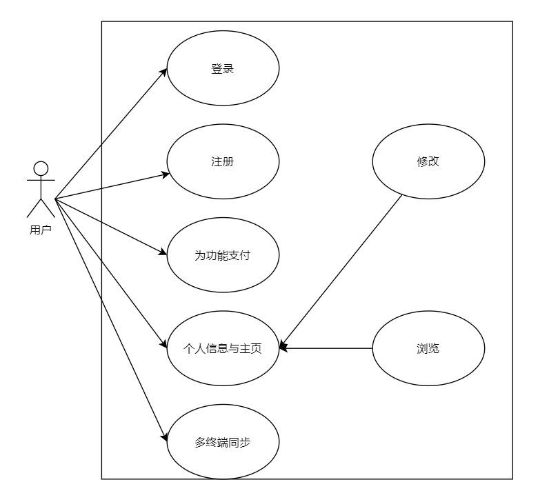

# 账户功能

用户可以离线在本地使用本应用，也可以注册并登录之后使用。账户功能能为用户提供同步、分享等更多的功能与服务。

## 用例图

## 用例描述

**登录：**用户使用注册的账户登录到软件。

**注册：**用户使用自己的个人信息进行帐号注册。

**为功能支付：**对于一些付费的功能，用户可以通过付费对这些功能进行解锁。

**个人信息和主页：**

​	修改：对用户个人主页上的信息进行修改。

​	浏览：对用户个人主页上的信息进行浏览和查看。

**多终端同步**：将本地的时间线将自动与云端同步，保证本地与云端数据一致。

---